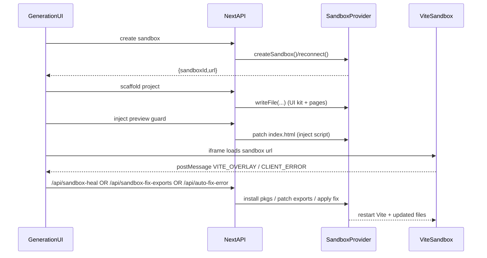

## Preview + Healing Architecture (Control Plane → Sandbox)

This repo is a **Next.js App Router control plane** that creates and manages an external **sandbox app** (usually a **Vite + React** project running on Vercel Sandboxes, E2B, or Modal). The control plane embeds the sandbox in an iframe and automatically heals common preview failures during code generation.

### Key concepts

- **Control plane UI**: [`app/generation/page.tsx`](app/generation/page.tsx)
  - Creates/reconnects sandboxes
  - Scaffolds a baseline project from a blueprint
  - Streams/apply AI-generated code (ticket-by-ticket)
  - Embeds the sandbox preview in an `<iframe>`
  - Receives sandbox error signals and triggers auto-healing / auto-fixing

- **Sandbox abstraction**: [`lib/sandbox/sandbox-manager.ts`](lib/sandbox/sandbox-manager.ts) + providers under [`lib/sandbox/providers/`](lib/sandbox/providers/)
  - Unifies `readFile`, `writeFile`, `runCommand`, `installPackages`, `restartViteServer`, `reconnect`, etc.

- **Scaffold**: [`app/api/scaffold-project/route.ts`](app/api/scaffold-project/route.ts)
  - Writes a baseline project (Vite or Next) into the sandbox
  - For Vite: generates a minimal UI kit under `src/components/ui/*`

- **Apply generated code**: [`app/api/apply-ai-code-stream/route.ts`](app/api/apply-ai-code-stream/route.ts)
  - Parses `<file path="...">...</file>` blocks
  - Writes files into the sandbox
  - Patches Vite entrypoints when the AI changes them
  - Safety net: creates placeholder modules when the AI references missing **relative** imports (so the preview can boot)

### Preview guard (hides raw Vite overlay + reports errors upstream)

- **Injection API**: [`app/api/sandbox-inject-preview-guard/route.ts`](app/api/sandbox-inject-preview-guard/route.ts)
- **Injected script**: [`lib/sandbox/preview-guard-injection.ts`](lib/sandbox/preview-guard-injection.ts)

The injected script:
- Catches `window.onerror` and `unhandledrejection` and posts messages to the parent window.
- Watches for `vite-error-overlay` via `MutationObserver`, extracts its text, then hides it and posts the error payload to the parent.

Message types sent from sandbox → control plane:
- `PAYNTO_SANDBOX_VITE_OVERLAY` (shadow-dom Vite overlay detected)
- `PAYNTO_SANDBOX_CLIENT_ERROR` / `PAYNTO_SANDBOX_CLIENT_REJECTION` (runtime crash / uncaught exception)

### Healing & deterministic auto-fixes

On the control plane side, [`app/generation/page.tsx`](app/generation/page.tsx) listens to the above messages and triggers:

- **Missing dependency install**:
  - Endpoint: [`app/api/sandbox-heal/route.ts`](app/api/sandbox-heal/route.ts)
  - Uses: [`lib/sandbox/healer.ts`](lib/sandbox/healer.ts) to detect missing packages from `/tmp/vite.log`, install them, restart Vite, and re-check health.

- **Export mismatch fix (deterministic)**:
  - Endpoint: [`app/api/sandbox-fix-exports/route.ts`](app/api/sandbox-fix-exports/route.ts)
  - Adds missing `export default` or missing named exports by appending safe `export ...` statements, then restarts Vite.

- **Fallback AI auto-fix**:
  - Endpoint: [`app/api/auto-fix-error/route.ts`](app/api/auto-fix-error/route.ts)
  - Uses LLM to rewrite the affected file content when deterministic paths don’t apply.

### Data flow

